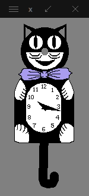

<p align="center">
  
</p>

catclock
========

This is a version of the X Window System xclock program, which has been enhanced with a "cat mode". Originally an X10 program by Tony Della Fera (MIT-Athena, DEC), Dave Mankins (MIT-Athena, BBN) and Ed Moy (UC Berkeley), Deanna Hohn and I (at Digital Equipment Corporation) crafted this for our own entertainment in the late 1980's. The graphics were inspired by the famous, indeed iconic, Kit-Cat (R) clock, one of which still hangs in my kitchen. I've put this up on github in honor of this year being the 30th anniversary of the introduction of X10, and because it's a fun desktop toy.

Since the time of our enhancements, the code has been changed very little, primarily to conform to now-more-strict compilers. Currently, it compiles and runs on various Linux distros, Cygwin, and OS X (XQuartz), with changes to the Makefile necessitated only by Macport's default installation of X-related files into /opt/local. The Imakefile is rather dated, and I've not yet attempted to try to make it work -- it's only included now for "historical" reasons. The original readme file, now named readme_original, is also included for historical reasons.

In addition to the cat mode, this version of xclock includes an alarm feature and an hourly chime (see the man page for details). Various X defaults and command-line switches can be used to control the colors for the cat. You may have to modify the Makefile's header and library paths for your machine's X configuration. The only "nonstandard" dependency is on Motif, which is easily obtainable from your favorite package manager.

## Tempo Tracking

This version is able to track the music tempo and move cat eyes and tail in sync with music.
To build it with tempo tracking enabled you will need an additional library which powers the tempo tracking:

```bash
sudo apt install libaubio5 libaubio-dev
```

Use the `WITH_TEMPO_TRACKER=1` option to compile with tempo tracker enabled:

```bash
make WITH_TEMPO_TRACKER=1
```

After running clock in "cat" mode run some PulseAudio mixer (for example - `pavucontrol`) and select desired audio source for analysis on the "Recording" tab.

## Usage

```
xclock [toolkitoptions]
       [-mode <analog, digital, cat>]
       [-alarm]  [-bell]  [-chime]
       [-file <alarm file>]  [-period <seconds>]
       [-hl <color>]  [-hd <color>]
       [-catcolor <color>]
       [-detailcolor <color>]
       [-tiecolor <color>]
       [-padding <pixels>]
       [-update <seconds>]
       [-ntails <number>]
       [-help]
```

Enjoy!
